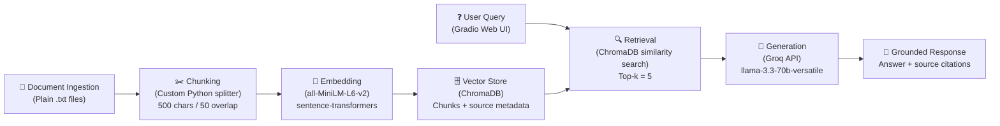

# Project 1 Planning: The Unofficial Guide

> Write this document before you write any pipeline code.
> Your spec and architecture diagram are what you'll use to direct AI tools (Claude, Copilot, etc.) to generate your implementation — the more specific they are, the more useful the generated code will be.
> Update the Retrieval Approach and Chunking Strategy sections if you change your approach during implementation.
> Update this file before starting any stretch features.

---

## Domain
My domain is on-campus dining guide at UC Davis. The information is available to find online if you are willing to to the research but since there are so many options it becomes difficult to navigate and find the answer that you are looking for. The domain will cover the different dining options and includes some reddit reviews in order to have more opinions in case the users wants recommendations.
<!-- What domain did you choose? Why is this knowledge valuable and hard to find through official channels? -->

---

## Documents

<!-- List your specific sources: URLs, subreddit names, forum threads, or file descriptions.
     Aim for at least 10 sources that together cover different subtopics or perspectives within your domain. -->

| # | Source | Description | URL or location |
|---|--------|-------------|-----------------|
| 1 |UCD official website | descriptor of UCD dining commons|https://housing.ucdavis.edu/dining/dining-commons/ |
| 2 |UCD official website | list of available dining options |https://housing.ucdavis.edu/dining/menus/ |
| 3 |UCD official website |main dining hall |https://housing.ucdavis.edu/dining/dining-commons/segundo/ |
| 4 |UCD official website |main dining hall |https://housing.ucdavis.edu/dining/dining-commons/cuarto/ |
| 5 |UCD official website |main dining hall |https://housing.ucdavis.edu/dining/dining-commons/tercero/ |
| 6 |UCD news |article talking about dining |https://aggiereader.ucdavis.edu/news/lets-talk-eating-campus |
| 7 |Scrubs cafe |menu of scrubs cafe |https://scrubscafe.ucdavis.edu/menus |
| 8 |reddit r/UCDavis |reddit review thread |https://www.reddit.com/r/UCDavis/comments/1n8zuem/diningcampus_food/ |
| 9 |reddit r/UCDavis |reddit review thread |https://www.reddit.com/r/UCDavis/comments/1nxjuiy/what_is_the_best_food_item_on_campus_and_where/ |
| 10 |reddit r/UCDavis |reddit review thread |https://www.reddit.com/r/UCDavis/comments/1dlosaj/dining_commons_food/ |
| 11 |ucd official | on campus restaurant | https://housing.ucdavis.edu/dining/the-gunrock/ |
| 12 |ucd official | on campus restaurant | https://housing.ucdavis.edu/dining/spokes/ |
| 13 |ucd official | on campus cafe | https://housing.ucdavis.edu/dining/coffee/ |
| 14 |ucd official | on campus convenience store | https://housing.ucdavis.edu/dining/markets/residential-markets/ |
| 15 | ucd official | on campus quick food | https://housing.ucdavis.edu/dining/latitude-market/ |
| 16 | ucd official | on campus convenience store | https://housing.ucdavis.edu/dining/markets/silo-market/ |
| 17 | ucd official | on campus food trucks | https://housing.ucdavis.edu/dining/food-trucks/ |
| 18 | ucd official | meal plans | https://housing.ucdavis.edu/dining/meal-plans/residential/ |
| 19 | ucd official | aggie cash | https://housing.ucdavis.edu/dining/aggie-cash/ |
| 20 | ucd official | vegan & vegetarian info | https://housing.ucdavis.edu/dining/nutrition/vegan-and-vegetarian-options/ |
| 21 | ucd official | halal and kosher info | https://housing.ucdavis.edu/dining/nutrition/halal-and-kosher-dining-options/ |
| 22 | ucd official | allergy info | https://housing.ucdavis.edu/dining/nutrition/food-allergens-and-ingredients-of-concern/ |
| 23 | ucd official | yogurt shop | https://housing.ucdavis.edu/dining/yoloberry-yogurt/ |
| 24 | ucd official | aggie swipe plus meal plan | https://housing.ucdavis.edu/dining/meal-plans/aggie-swipe-plus/ |
---

## Chunking Strategy

<!-- How will you split documents into chunks?
     State your chunk size (in tokens or characters), overlap size, and explain why those
     numbers fit the structure of your documents.
     A review-heavy corpus warrants different chunking than a long FAQ. -->

**Chunk size:**

500 character chunks

**Overlap:**

50 character overlap

**Reasoning:**

I will use a chunk size of about 500 characters and the overlap of 50 characters. 
Since most of my sources are on the shorter side. Using a more moderate size chunk will allow for context to be
maintained while keeping the chunks small enough to be relevant to the questions asked instead of the entire
source.

---

## Retrieval Approach

<!-- Which embedding model are you using (e.g., all-MiniLM-L6-v2 via sentence-transformers)?
     How many chunks will you retrieve per query (top-k)?
     If you were deploying this for real users and cost wasn't a constraint, what tradeoffs
     would you weigh in choosing a different embedding model — context length, multilingual
     support, accuracy on domain-specific text, latency? -->

**Embedding model:**
all-MiniLM-L6-v2 via sentence-transformers

**Top-k:**
5 chunks

**Production tradeoff reflection:**

I would use a more powerful embedding model such as those from open ai which will be able to handle much more
context and I could embed the entire menu schedules for the week. I would also consider if the more powerful
model will create much more complex embeddings which will increase compuational overhead and by extension 
latency when being used. I need to maintain accuracy while keeping the latency low. I could also consider
tuning the LLM to better understand some of the unique names and concepts behind UCD's unique names of
dining halls and their Aggie cash system. Considering unlimited budget I would like to use a multilingal model
to support different languages since the University is a melting pot of people from many countries even though
the expectation is that everyone is proficient in english.

---

## Evaluation Plan

<!-- List your 5 test questions with their expected correct answers.
     Questions should be specific enough that you can judge whether the system's response
     is right or wrong. "What are good dining halls?" is too vague.
     "What do students say about wait times at [dining hall name] during lunch?" is testable. -->

| # | Question | Expected answer |
|---|----------|-----------------|
| 1 |Which dining locations accepts meal plans? | The are 3 dining commons Segundo, Tercero and Cuarto as well as the Latitude Restaurant |
| 2 |Does UC Davis dining offer halal or kosher options? |Yes, at UC Davis Dining Services, the "H" icon is used to help our dining patrons easily identify dishes that meet Halal dietary guidelines and they also offer meals designated as "Kosher-Friendly". |
| 3 |What is Aggie Cash and how does it work? |Aggie Cash is a declining balance (debit) account students, faculty and staff use to purchase food at UC Davis Dining Services locations. It also comes with a variety of benefits such as 10% discount on most UCD dining locations |
| 4 |What are the meal plan options for students living in resident halls? | They offer a 5-day and 7-day plans both plans also come with $200 in Aggie Cash per quarter. |
| 5 |How does pricing work at the dining common's and latitude? |It is all-you-care-to-eat you pay a flat cost if not on a meal plan and are welcome to eat dishes freely and stay as long as you want. |

---

## Anticipated Challenges

<!-- What could go wrong? Name at least two specific risks with reasoning.
     Consider: noisy or inconsistent documents, missing source attribution, off-topic
     retrieval, chunks that split key information across boundaries. -->

1. Reddit and Yelp reviews are opinion based and often contradictory, one student says Segundo is great, another says it's terrible. When the retriever pulls chunks with opposing opinions, the LLM has to reconcile conflicting information, which can lead to vague or misleading answers when there is no single source of truth answer.

2. UC Davis-specific terminology may embed poorly names like "Aggie Cash," "YoloBerry," "Segundo," "Tercero," and "Latitude" are domain-specific. The embedding model (all-MiniLM-L6-v2) was trained on general text, so a query like "Where can I use Aggie Cash?" might not semantically match a chunk that explains the Aggie Cash system, leading to off-topic retrieval.

---

## Architecture

<!-- Draw a diagram of your pipeline showing the five stages:
     Document Ingestion → Chunking → Embedding + Vector Store → Retrieval → Generation
     Label each stage with the tool or library you're using.
     You can use ASCII art, a Mermaid diagram, or embed a sketch as an image.
     You'll use this diagram as context when prompting AI tools to implement each stage. -->

---

## AI Tool Plan

<!-- For each part of the pipeline below, describe:
     - Which AI tool you plan to use (Claude, Copilot, ChatGPT, etc.)
     - What you'll give it as input (which sections of this planning.md, which requirements)
     - What you expect it to produce
     - How you'll verify the output matches your spec

     "I'll use AI to help me code" is not a plan.
     "I'll give Claude my Chunking Strategy section and ask it to implement chunk_text()
     with my specified chunk size and overlap" is a plan. -->

**Milestone 3 — Ingestion and chunking:**
- Tool: Claude Code
- Input: I'll give Claude Code my Chunking Strategy section (500-char chunks, 50-char overlap) and the Documents table listing my sources. I'll also share a sample .txt file from documents/ so it can see the actual structure of my cleaned text.
- Expected output: A custom Python function (e.g. chunk_text()) that loads .txt files from documents/, and splits them into chunks matching my specified size and overlap. It should also attach source metadata (filename) to each chunk.
- Verification: I'll print 5 representative chunks and check that each one is readable, self-contained, and correctly labeled with its source file. I'll also verify the total chunk count falls in a reasonable range (50–2000).
- Note: Documents will be manually copied from web sources and saved as .txt files in documents/ since several sources (Reddit, Yelp) are difficult to scrape programmatically.

**Milestone 4 — Embedding and retrieval:**
- Tool: Claude Code
- Input: I'll give Claude Code my Retrieval Approach section (all-MiniLM-L6-v2, top-k=5) and the Architecture diagram so it understands how embedding and retrieval connect to the rest of the pipeline. I'll share the chunk output format from Milestone 3 so it knows the input structure.
- Expected output: A script that embeds all chunks using sentence-transformers, stores them in ChromaDB with source metadata, and a retrieval function that accepts a query string and returns the top-5 most similar chunks with their source info and distance scores.
- Verification: I'll test retrieval with at least 3 of my 5 evaluation questions and check that the returned chunks are relevant to each query and that distance scores on top results are below 0.5.

**Milestone 5 — Generation and interface:**
- Tool: Claude Code
- Input: I'll give Claude Code the Grounded Generation requirements from project.md (answer only from retrieved context, cite sources, refuse when documents don't cover the question) and my retrieval function from Milestone 4. I'll specify that the LLM is Groq's llama-3.3-70b-versatile and that the UI should use Gradio.
- Expected output: Two files — query.py containing an ask() function that retrieves chunks and calls Groq to generate a grounded response with source citations, and app.py containing the Gradio web interface that calls ask() and displays the answer and sources separately.
- Verification: I'll test end-to-end with 2–3 queries to confirm responses are grounded in retrieved chunks and include source attribution. I'll also ask a question my documents don't cover to verify the system refuses rather than hallucinating.
